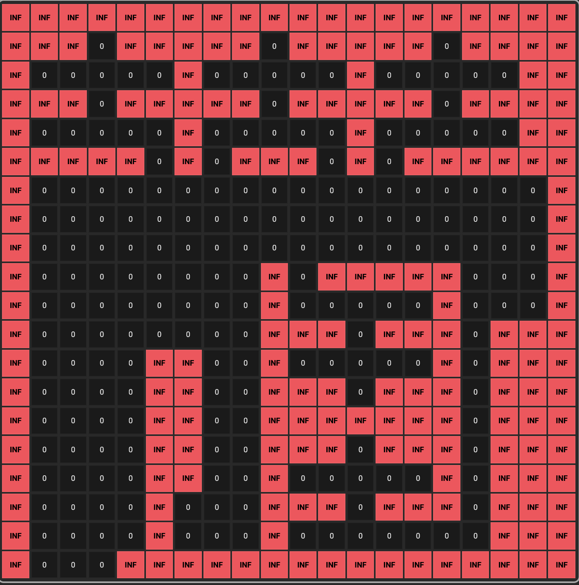
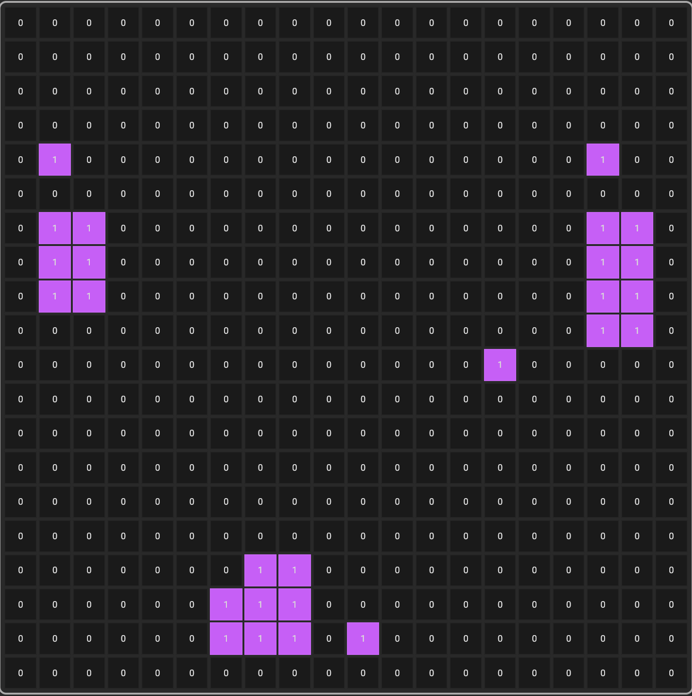
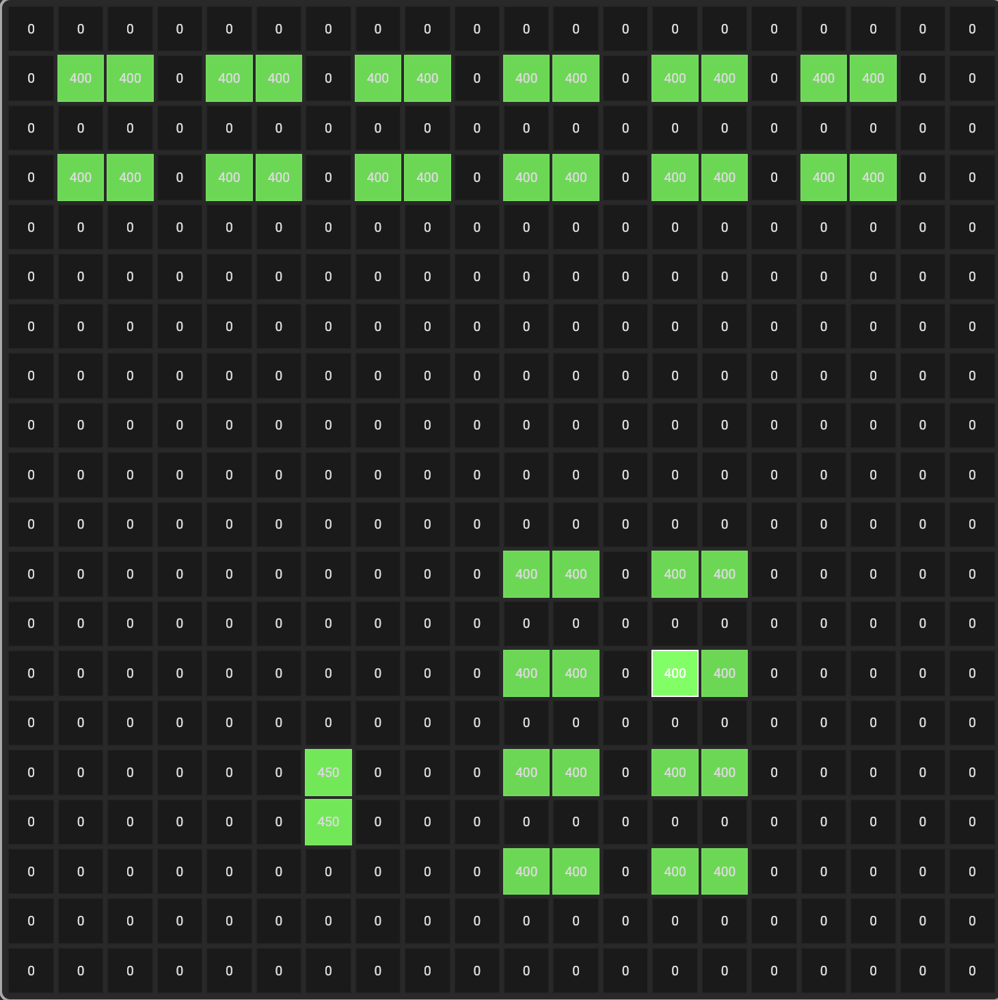
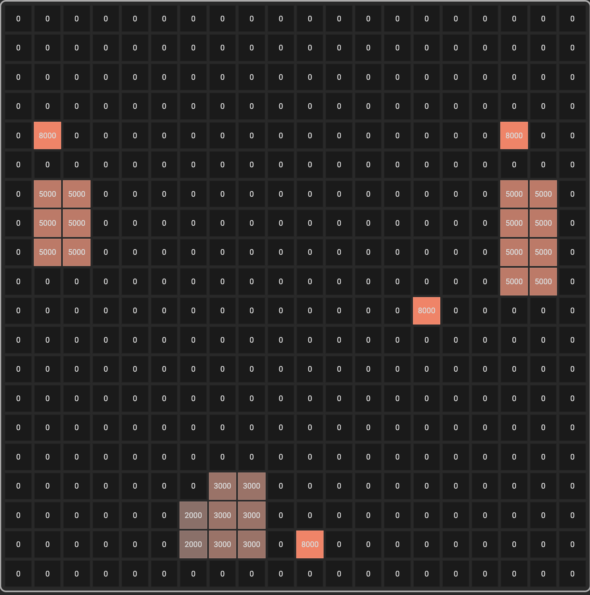
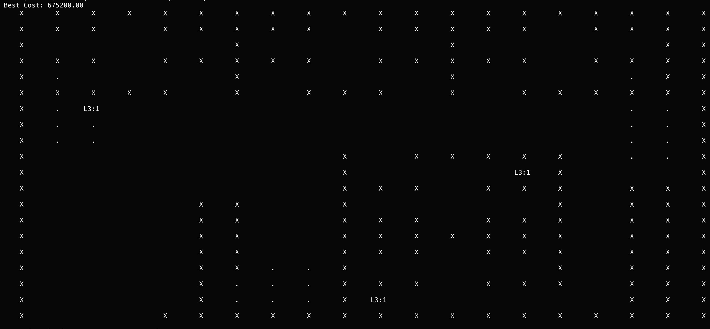
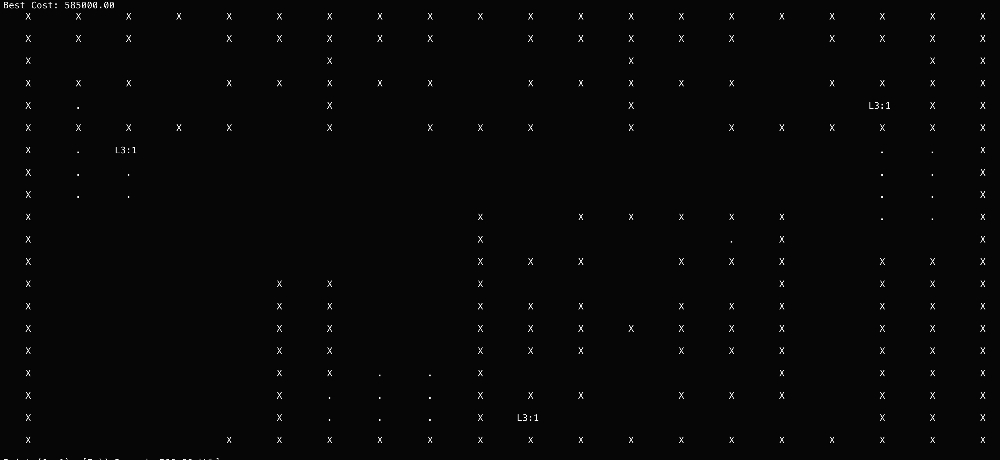
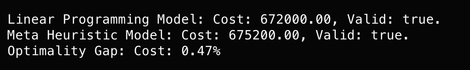

# Electric Vehicle Charging Station Problem

`EVCSP` is the problem of optimal allocation of charging station, across given terrain map.
My implementation solves this problem by taking following parameters: budget, 
`distances_map`, `demand_map`, `land_rental_cost_map` and `poi_map`. Optimizer want's to minimize
`total cost`, containing to `users cost` and `operator cost`.

## Map Creator
For creating mentioned maps necessary for this optimization problem, following map Creator
was created:

EVCSP Map Creator: [Link](https://github.com/Bezik1/EVCSP-Map-Creator)

It allows user to create each type of map as he pleases and it posess option
to download created maps in .json format managable, by this C++ application.

Downloaded jso file containing maps, must then be placed in `./data` folder. This
location is default directory, where model tries to find `maps.json` file.

## Hyperparameters

Hyperparameters of EVCSP model are located in `./data/hyperparameters.json` directory.
They include:
- max_stations_per_cell (int): Maximal number of stations we can put in one cell.
- budget (double): Budget for the whole project.
- mip_gap (double): Approximated variation from optimal solution.
- stations_powers (double[2]): Powers of each station.
- initial_costs (double[2]): Cost of installation of each station.
- maintenance_costs (double[2]): Daily maintanance cost for each station.

## Documentation

Formal paper for this problem, one can find in `./docs/EVCSP_2026.pdf` directory.
It contains mathematical formulation and comparison, between meta heuristic and
linear programming approaches of solving this problem.

## Commands

```bash
# Initiates project.
cmake -B build -S .

# Removes current license path.
unset GRB_LICENSE_FILE
# Creates system path to the license.
export GRB_LICENSE_FILE="example_path"

# Edit file for chaning license path.
nano ~/.zshrc

# Builds app.
cmake --build build

# Runs app.
./build/EVCSP_Application
```

## Maps

### Distances Map
Represents obstacles and costs from travelling from
given node to another.



### Point Of Intrest (POI) Map
Represents the locations, where we possibly can build
our electric vehicle charging stations.



### Demand Map
Represents energy consumption demand of electric vehicle users,
at a given piece of terrain.



### Land Rental Cost Map
Represents rental cost of specific point of intreset on the map.



#### BFOA Solution


#### Gurobi Solution


#### Comparison
We can see that linear programming model is slightly better,
however we can tune meta heuristic model, to be much faster
than the gurobi based solution.



## Technologies
<p align="center">
    <a href="https://skillicons.dev">
        
    </a>
</p>